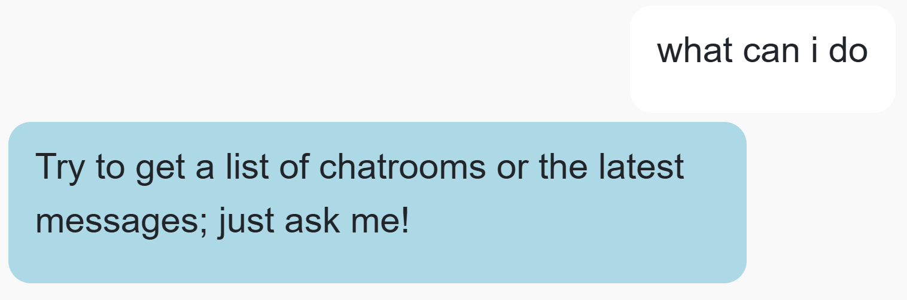
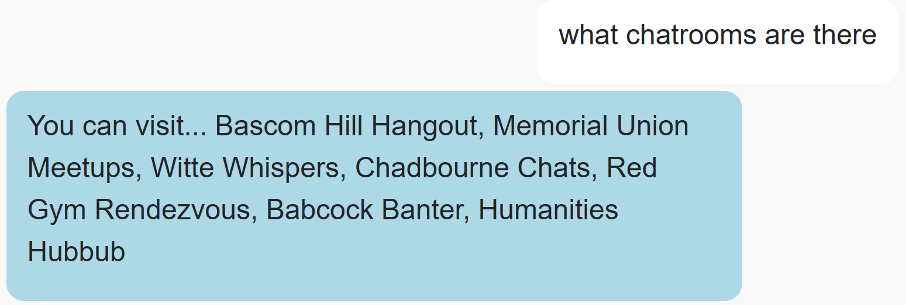
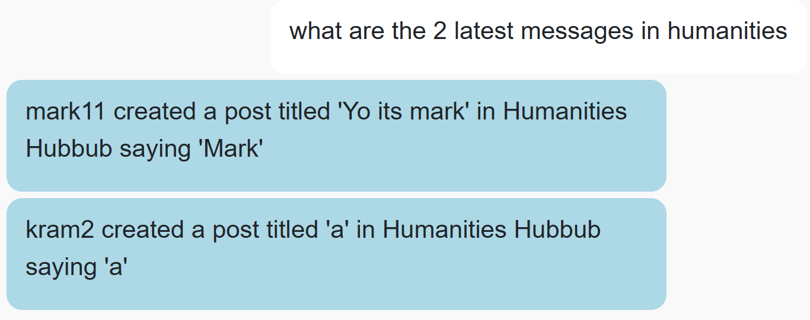
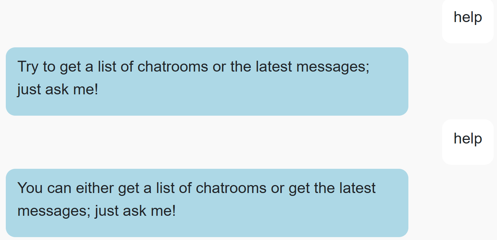

# CS571-S25 HW10: BadgerChat (Voice!)

Welcome back to our final installment of BadgerChat! For this assignment, you will re-implement BadgerChat as *a chat application*. By completing this class, you will have developed a web, mobile, and chat interface for BadgerChat! 🥳🎉 

## Setup

You will complete a chat agent using [Wit.AI](https://wit.ai/).

The starter code provided to you was generated using [vite](https://vitejs.dev/guide/). Furthermore, [bootstrap](https://www.npmjs.com/package/bootstrap) and [react-bootstrap](https://www.npmjs.com/package/react-bootstrap) have already been installed. In this directory, simply run...

```bash
npm install
npm run dev
```

Then, in a browser, open `localhost:5173`. You should *not* open index.html in a browser; React works differently than traditional web programming! When you save your changes, they appear in the browser automatically. I recommend using [Visual Studio Code](https://code.visualstudio.com/) to do your development work.

## API Notes

All routes are relative to `https://cs571api.cs.wisc.edu/rest/s25/hw10/`

 - **This API shares the same database as HW6 and HW9.**
 - **This API only supports getting chatrooms and messages; it does not support authentication.**
 - **This API does NOT paginate messages *nor* is a chatroom name required.**
   - Instead, a `chatroom` and max `num` of posts (up to 10) may *optionally* be specified.

See `API_DOCUMENTATION.md` for full details.

| Method | URL | Purpose | Return Codes |
| --- | --- | --- | --- |
| `GET`| `/chatrooms` | Get all chatrooms. | 200, 304 |
| `GET` | `/messages?chatroom=NAME&num=NUM`| Get latest `NUM` messages for specified chatroom. | 200, 400, 404 |

## Special Requirements
 - While you may hardcode chatroom names as an entity of your Wit.AI agent, you may *not* hardcode them in your JavaScript code.
 - *Each* intent within your Wit.AI agent should be trained on **5+ utterances** 
 - When submitting your project, please be sure to...
   - **...leave your `CS571_WITAI_ACCESS_TOKEN` hardcoded.** The graders will need this for their testing.
   - **...include a .ZIP of your Wit.AI agent!** Further instructions can be found underneath "Submission Details".

## BadgerMart

### 1. `get_help`

In your Wit.AI agent, train your agent to understand a `get_help` intent. Utterances along the lines of "help", "get help", or "what can I do" should trigger this intent. In response, the agent should inform the user of which actions it supports.



### 2. `get_chatrooms`

In your Wit.AI agent, train your agent to understand a `get_chatrooms` intent. Utterances along the lines of "chatrooms", "what chatrooms are there", or "what chatrooms can I use" should trigger this intent.

Then, when this intent is triggered, the agent should respond with the full list of chatrooms. You *must* get this data by fetching from the API; you may *not* hardcode the chatroom names.



### 3. `get_messages`

In your Wit.AI agent, train your agent to understand a `get_messages` intent. Utterances along the lines of "messages", "give me the 4 latest posts", or "what are the 3 latest posts in Bascom Hill Hangout" should trigger this intent.

Then, when this intent is triggered, the agent should respond with the latest X messages for Y chatroom as *consecutive responses*.

Note that both X and Y are optional entities. If the number is omitted, you may assume that it is 1. If the chatroom is omitted, you may assume that it is the latest overall posts across all chatrooms. You do **not** need to handle cases where the number is less than 1, greater than 10, negative, or a floating point number. You **can assume** a user will always either (a) not type a number at all or (b) type in a number between 1 and 10.

**Hint:** For this intent, you will likely need to create an entity within your Wit.AI agent. You may hardcode chatroom names within the Wit.AI agent, but you may not hardcode chatroom names within your React code.

**Hint:** You may find it helpful to provide synonym(s) for each of your chatrooms, e.g. "Witte Whispers" may be referred to as "Witte", however, this is up to you!



### 4. Varied Responses

Go back to each of the previous intents and vary the way in which your agent responds. That is, rather than responding in the same way for each intent, choose from a random verbiage. For example, when a user asks for help, the agent can respond with "In BadgerChat, you can..." or "Try out using..." For each intent, have atleast 2 different ways the agent can respond.



### 5. Tell Us What Works

As you've probably seen by now, Wit.AI's language model *isn't* the latest and greatest :) So, to help our graders out, edit this `README.md` file with at least 3 ways to prompt each of your intents below that you've seen work. **Example text is given below, please replace these with what you've used and seen work.**

`get_help`
 - help
 - get help
 - what can I do
 - how does this work
 - what can YOU do
 - hello
 - what is this
 - what functionality does this have

`get_chatrooms`
 - chatrooms
 - what chatrooms are there
 - what chatrooms can I use
 - chat
 - where can i post
 - where are people chatting


`get_messages`
 - messages
 - give me the 4 latest posts
 - what are the 3 latest posts in Bascom Hill Hangout
 - show me posts
 - pull recent messages
 - show me messages
 - fetch the most recent post from red gym
 - posts
 - what's happening in mem u?
 - what are the latest posts
 - show me the latest posts in chad
 - show me posts on the hill
 - show me the latest posts in babcock
 - get me the last 3 posts

### Submission Details

There is no video demo for this assignment; simply...
 - Be sure to complete Step 5 above.
 - Leave your `CS571_WITAI_ACCESS_TOKEN` hardcoded.
 - **INCLUDE A COPY OF YOUR WIT.AI AGENT!** You can download this by visiting your `Wit.AI Project > Management > Settings > Export Your Data > Download .zip with your data`. Please commit and push this ZIP file as a part of your Git repository.

Then add, commit, and push your code!
